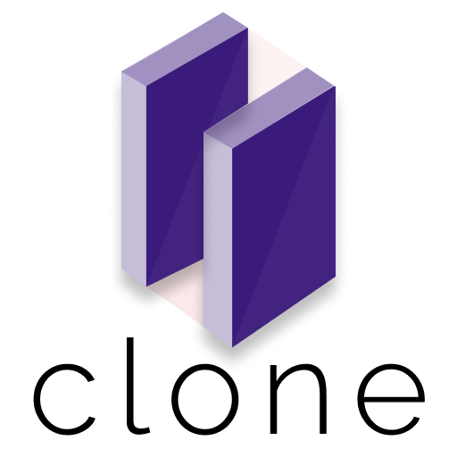

# Clone

<p align="center">

</p>

<h2 align="center">recursive deep copy for nested collections
</h2>
This plugin helps with recursive deep copying for nested collections, such as [List], [Map], [Set], ensuring that the cloned object is independent and does not share references with the original object.

## Install

Add the following dependency to your `pubspec.yaml` file:

```yaml
dependencies:
    clone: ^1.0.0
```

## Features

- Deep copying of lists, maps, and sets with nested structures.
- Easy integration into existing Dart projects.

## Usage

```dart
// import this
import 'package:clone/clone.dart';

// clone it!
List clonedList = originalList.clone();
Map clonedMap = originalMap.clone();
Set clonedSet = originalSet.clone();
```

that's it!

If you're interested in learning more, check out the
[example usage](example/bin/example.dart)

## Todos

- [ ] fast cloning for longer collection
- [ ] add benchmarks
